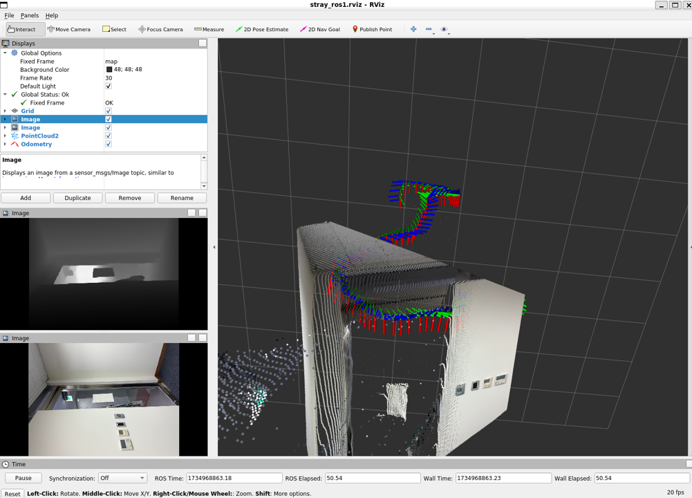

# strayscanner-ros1bag-converter

## What is this?
- If you have iPhone Pro (>12) or iPad Pro (>2020), 
- You can easily turn your iPhone data into ros1 topics.
- This is a modification of the existing repository https://github.com/gisbi-kim/strayscanner-ros2bag-converter to support ros1.
- First, you should use this app and get data as a file: 
    - [https://github.com/strayrobots/scanner](https://github.com/strayrobots/scanner)
- and follow the below <how to use ... > section, then you can get these types of data:
    - supported data and their types:

            Topic List with Types:
            ---------------------------------------
            /imu : sensor_msgs/msg/Imu
            /camera/depth : sensor_msgs/msg/Image
            /camera/rgb : sensor_msgs/msg/Image
            /pointcloud : sensor_msgs/PointCloud2
            /odometry : nav_msgs/Odometry

## How to use with sample data 
- A tutorial 
    - unzip the sample_data/8653a2142b
        - `unzip sample_data/8653a2142b.zip -d sample_data/`
    
    - a) using docker (recommended)
        - `docker build docker/ -t ros1-noetic` and run `./docker/run_docker.sh`
    - b) using native ros1 noetic
        - Install [ros-noetic-desktop](https://wiki.ros.org/noetic/Installation/Ubuntu) (for rviz) 
    - run ros core & node
        - `roscore`
        - `python3 publish_ros1_msgs.py /ws/sample_data/8653a2142b/`
- You can check the results 
    - using rviz, the example is: 
        - 
    - and topic echo 
        - 

## Additional Feature
- The script automatically checks for the existence of the `<data_dir>/images/` directory and parses the `rgb.mp4` file with HEVC codec to generate image files.

## Acknowledgement 
- Big thanks to the Stray Robots Team
    - [https://github.com/strayrobots/scanner](https://github.com/strayrobots/scanner)
