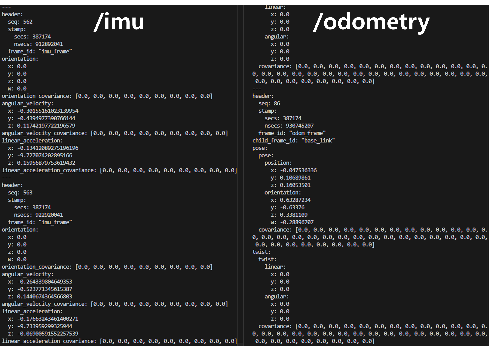

# strayscanner-ros2bag-converter

## What is this?
- If you have iPhone Pro (>12) or iPad Pro (>2020), 
- You can easily turn into your iPhone data into ros2 topics.
    - supported data and their types:

            Topic List with Types:
            ---------------------------------------
            /imu : sensor_msgs/msg/Imu
            /camera/depth : sensor_msgs/msg/Image
            /camera/rgb : sensor_msgs/msg/Image
            /pointcloud : sensor_msgs/msg/PointCloud2
            /odometry : nav_msgs/msg/Odometry

## How to use with sample data 
- A tutorial 
    - unzip the sample_data/8653a2142b
    - recommned to use docker
        - e.g., `docker pull ros:rolling-ros-core`
    - `cd docker/run` and run `./docker_run_ros.sh`
        - and install some dependencies within the docker container ... (e.g., rviz2)
    - then, `python3 publish_ros2_msgs.py /ws/sample_data/8653a2142b/8653a2142b/`
- You can check the results 
    - using rviz2, the example is: 
        - 
    - and topic echo 
        - 

## Acknowledgement 
- Big thanks to the Stray Robots Team
    - [https://github.com/strayrobots/scanner](https://github.com/strayrobots/scanner)